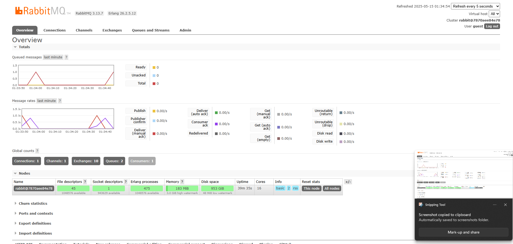

a. What is amqp?
- AMQP (Advanced Message Queuing Protocol) adalah protokol komunikasi standar yang dirancang untuk sistem antrian pesan (message queuing) dan sering digunakan dalam arsitektur sistem terdistribusi. Protokol ini memungkinkan aplikasi yang berbeda—bahkan yang dibuat dengan bahasa pemrograman berbeda—untuk saling bertukar pesan secara andal dan aman melalui message broker seperti RabbitMQ. AMQP mendukung fitur-fitur penting seperti pengiriman pesan terjamin, antrian pesan, routing, dan keamanan, sehingga sangat cocok untuk aplikasi berskala besar yang membutuhkan sistem komunikasi asinkron antar layanan.

b. What does it mean? guest:guest@localhost:5672 , what is the first guest, and what
is the second guest, and what is localhost:5672 is for?
- Format guest:guest@localhost:5672 adalah URI (Uniform Resource Identifier) yang digunakan untuk menghubungkan aplikasi ke server RabbitMQ menggunakan protokol AMQP. Kata pertama guest adalah username yang digunakan untuk login ke server RabbitMQ, sedangkan kata kedua guest setelah tanda titik dua adalah password-nya. localhost menunjukkan bahwa server RabbitMQ berada di komputer lokal (host yang sama dengan aplikasi), dan 5672 adalah nomor port default yang digunakan oleh RabbitMQ untuk menerima koneksi AMQP. Jadi, URI tersebut menyatakan bahwa aplikasi akan login menggunakan akun guest ke RabbitMQ yang berjalan secara lokal melalui port 5672.

c. Screen shot multiple run with sleep and why the total number queue is as such
- 
- disini peak queuenya hanya 1 karena saat saya menjalankan cargo run di publisher, compilingnya sangat lama oleh karena itu saya tidak bisa merun banyak simulasi sekaligus